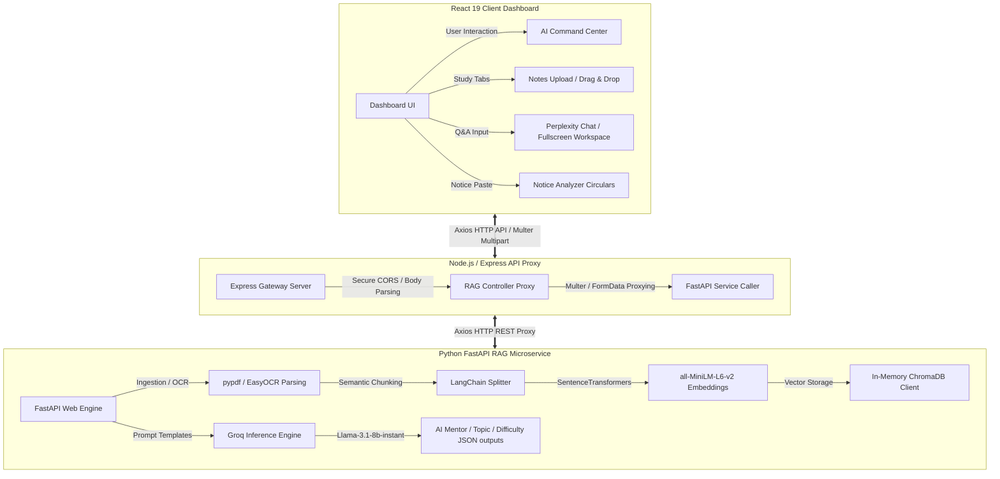

# CampusFlow — Full-Stack AI Study Buddy & Command Center

CampusFlow is a premium, high-fidelity AI-powered SaaS academic co-pilot designed to help students vectorize lecture notes, ask questions, generate 3D difficulty-rated flashcards, run multiple-choice mock exams, and analyze administrative notice circulars.

The platform is designed with a modern **SaaS + Glassmorphic** theme (defaulting to dark mode) with hardware-accelerated animations and slow-drifting colored background blobs for an immersive, distraction-free study environment.

---

## 📐 System Architecture

CampusFlow operates on a decoupled full-stack architecture spanning three primary service layers:



---

## 🛠️ Technology Stack

| Layer | Technologies | Description |
| :--- | :--- | :--- |
| **Frontend** | React 19, Vite, Tailwind CSS v3, Framer Motion, React Markdown, Lucide Icons | Responsive, glassmorphic dashboard defaulting to dark theme with smooth sub-250ms hardware transitions and Markdown math rendering. |
| **API Gateway** | Node.js, Express, Multer, Axios, FormData | Secure proxy layer directing frontend queries to the FastAPI RAG service and providing fail-safes. |
| **RAG Microservice** | Python 3.10+, FastAPI, ChromaDB, SentenceTransformers, LangChain, EasyOCR, pypdf, Uvicorn | Artificial intelligence engine executing semantic document chunking, embedding, vector database indexing, page-by-page PDF parsing, image OCR character extraction, and LLM completions. |
| **LLM Inference** | Groq API, Llama-3.1-8b-instant | Real-time, ultra-low latency JSON structural responses for study materials, QA, and notice analysis. |

---

## 📁 Repository Structure

```text
campusflow/
├── client/                 # React 19 frontend application (Vite)
│   ├── src/
│   │   ├── components/     # Reusable UI widgets & layouts
│   │   │   ├── common/     # AI Actions FAB, ProtectedRoute, ThemeToggle
│   │   │   ├── layout/     # DashboardLayout, Navbar, Sidebar
│   │   │   └── studybuddy/ # NotesUpload, AskQuestion, FullscreenChat, Quiz, Flashcards
│   │   ├── context/        # AuthContext, ThemeContext
│   │   ├── hooks/          # useAuth, useTheme, useApi
│   │   ├── pages/          # Dashboard, Login, NoticeAnalyzer, StudyBuddy, StudyBuddyFullscreen
│   │   └── services/       # Axios API & RAG clients
│   └── tailwind.config.js  # Typography scales & color theme configurations
│
├── server/                 # Express backend API Gateway proxy
│   ├── routes/             # REST routing tables
│   ├── controllers/        # Payload parsing & validation
│   └── services/           # Axios forwarding proxy layers with Multer
│
└── rag_service/            # Python FastAPI vector search RAG engine
    ├── main.py             # Web endpoints & payload schemas
    ├── rag.py              # Semantic vector indexing, embeddings, & ChromaDB
    ├── prompts.py          # Structured templates for flashcard, quiz, & notice models
    ├── utils.py            # Groq API client with strict JSON parsing
    └── models.py           # Pydantic typing validations
```

---

## 🚀 Rapid Startup Guide (Separate Terminals)

To run the entire CampusFlow platform locally on your machine, launch the three services in three separate terminal windows:

### Terminal 1: Python RAG Microservice (AI Engine)
```powershell
cd "campusflow/rag_service"

# 1. Create and activate virtual environment
python -m venv venv
.\venv\Scripts\Activate.ps1   # Windows PowerShell
# source venv/bin/activate    # macOS / Linux

# 2. Install AI & document dependencies
pip install -r requirements.txt

# 3. Configure environment keys
# Create a .env file containing:
# GROQ_API_KEY=your_groq_api_key_here

# 4. Start the FastAPI server on port 8001
uvicorn main:app --reload --port 8001
```
*Verify endpoints are active by visiting **http://localhost:8001/docs**.*

### Terminal 2: Node.js/Express Server (API Gateway)
```powershell
cd "campusflow/server"

# 1. Install gateway dependencies
npm install

# 2. Configure environment details
# Create a .env file containing:
# PORT=5000
# RAG_SERVICE_URL=http://localhost:8001
# MONGO_URI=optional_mongodb_atlas_uri

# 3. Start the dev gateway proxy on port 5000
npm run dev
```

### Terminal 3: React Frontend (Client Dashboard)
```powershell
cd "campusflow/client"

# 1. Install frontend packages
npm install

# 2. Launch the Vite development server on port 5173
npm run dev
```
*Open your browser and navigate to **http://localhost:5173**.*

---

## 💡 Important Hackathon Demo Notes

1. **ChromaDB In-Memory Strategy:** To ensure maximum speed and bypass database file locks during presentations, ChromaDB is configured **in-memory**. If the Python FastAPI service is restarted, the database is cleared. Simply go to the **Notes Upload** tab on the dashboard, select a subject, and upload your PDF, Image, or text notes again to instantly re-index them.
2. **Dynamic Telemetry Tracking:** The dashboard homepage loads dynamic metrics from browser `localStorage` under active namespaces. Every time notes are uploaded, flashcards are made, or quizzes are completed, the numbers in your AI Command Center increment in real-time.
3. **Database Fallbacks:** If `MONGO_URI` is not provided in the Express `.env` file, the backend automatically falls back to in-memory mode, making it completely resilient and easy to run on any machine without database setup.
